# CityMind — LLM-Powered Urban Agents

**A comprehensive modelling of human behaviour in an urban environment**

Sahil Yousaf | Shajay Bhooshan — MaAI02, Institute for Advanced Architecture of Catalonia (IAAC)


<p align="center">
  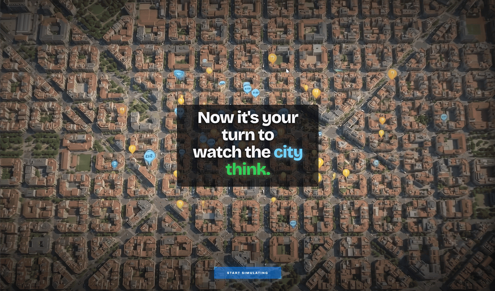
</p>

---

## Table of Contents

- [Research Question](#research-question)
- [State of the Art](#state-of-the-art)
- [The Knowledge](#the-knowledge)
  - [Map Data](#1-map-data)
  - [Vision Data](#2-vision-data)
  - [Vision Analysis (VLM)](#3-vision-analysis-vlm)
- [The Agent](#the-agent)
  - [Profile & Daily Plan](#profile--daily-plan)
  - [Mobility](#mobility)
  - [Emotions](#emotions)
  - [LLM Selection](#llm-selection)
- [Prompt Architecture](#prompt-architecture)
  - [How Agents Think](#how-agents-think)
  - [Cognition Prompt — Inner Life](#cognition-prompt--inner-life)
  - [Mobility Prompt — Street-Level Decisions](#mobility-prompt--street-level-decisions)
  - [Needs Prompt — Environmental Response](#needs-prompt--environmental-response)
- [Human Calibration](#human-calibration)
  - [Needs Decay Rates](#needs-decay-rates)
  - [Cross-Need Coupling](#cross-need-coupling)
  - [Exploration Budgets](#exploration-budgets)
  - [Archetype Memory Policies](#archetype-memory-policies)
- [The City](#the-city)
  - [Data Storage](#data-storage)
  - [LLM Engine](#llm-engine)
- [Observations](#observations)
- [Architecture](#architecture)
- [Quick Start](#quick-start)
- [UI Tour](#ui-tour)
- [API Reference](#api-reference)
- [Project Structure](#project-structure)
- [Tech Stack](#tech-stack)
- [Benchmarks](#benchmarks)
- [Limitations](#limitations)
- [Future Applications](#future-applications)
- [Citation](#citation)
- [References](#references)

---

## Research Question

> **Can urban ABM simulations be capable of behavioural spatial awareness and action?**

CityMind is an agent-based pedestrian simulation where each agent **reasons** about its movement decisions using a large language model instead of following predefined rules. Agents perceive their surroundings through street-level imagery, maintain memory of visited places, and adapt their behavior based on individual needs, personality, and emotional state.

Set in Barcelona's Eixample district, the system models pedestrian archetypes — residents, commuters, tourists, and students — each with distinct movement patterns, goals, and decision-making styles shaped by LLM-generated cognition.

---

## State of the Art

### Generative Agents (Simulacra)

<p align="center">
  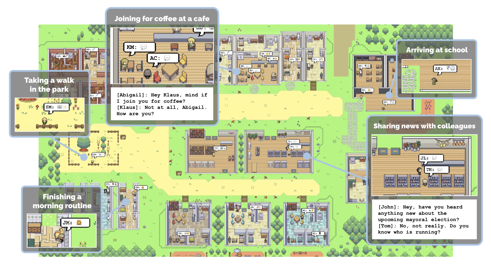
  &nbsp;
  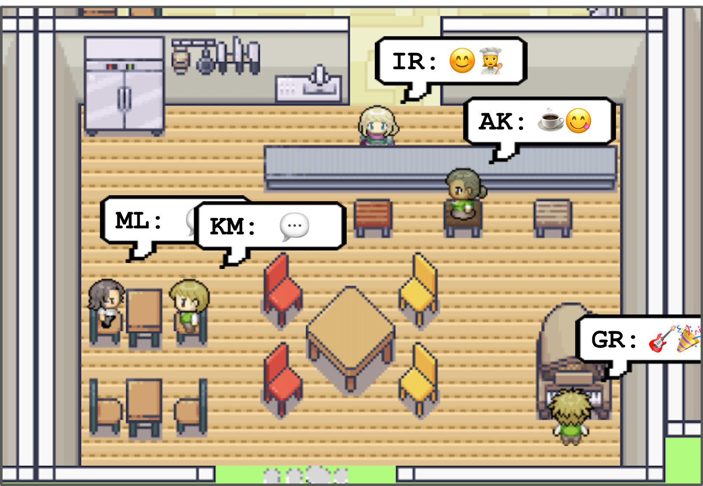
</p>

- 25 LLM-powered agents with manually written personas
- Behavior generated from 1,000 audio transcriptions
- Created a closed experimental ecosystem achieving **85% similarity to real human behavior**

> Park, J., O'Brien, J., Cai, C., Morris, M., Liang, P., & Bernstein, M. (2023). *Generative Agents: Interactive Simulacra of Human Behavior.* Proceedings of the 36th Annual ACM Symposium on User Interface Software and Technology.

### CitySim

<p align="center">
  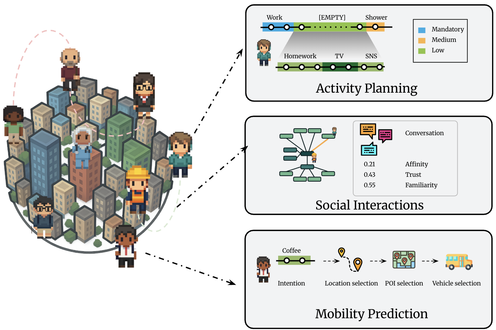
</p>

Simulated movement in the city of Shibuya, Tokyo — based on preferences of spaces with respect to Google Map ratings and verified databases. Jumps from preferences of spaces with respect to profile descriptions and a daily planning module.

### Contributing to the Gap

| Limitation | CitySim | Simulacra |
|---|---|---|
| Movement paths | Non-traceable path of movement | Planar spatial understanding |
| Spatial awareness | Missing spatial awareness | Virtual environment |
| Transferability | Activity planning module only | Non-transferable |

CityMind addresses these gaps by combining **traceable spatial movement** on real urban networks with **street-level visual perception** and **emotionally-aware LLM cognition**.

---

## The Knowledge

The knowledge layer provides three data sources that ground agent behavior in real-world urban context.

<p align="center">
  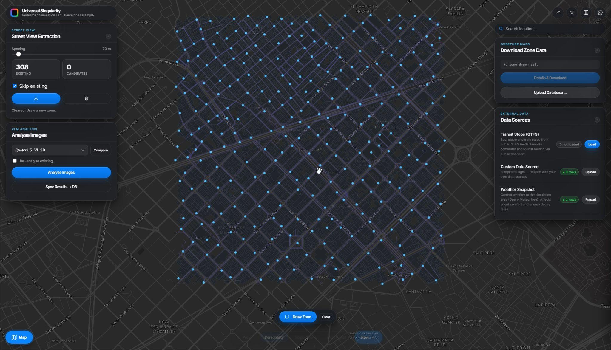
</p>

### 1. Map Data

<p align="center">
  
</p>

**Case Study: Eixample, Barcelona**

<p align="center">
  
</p>

Qualities that make Eixample ideal for pedestrian simulation:
- Walkability-prioritised city design
- The iconic Eixample grid with chamfered intersections
- Distinct spatial features per block
- Rich touristic environment

Data sourced from **Overture Maps** (via BigQuery) — chosen over OSM due to OSM's unreliability and inconsistent public maintenance for structured queries.

### 2. Vision Data

<p align="center">
  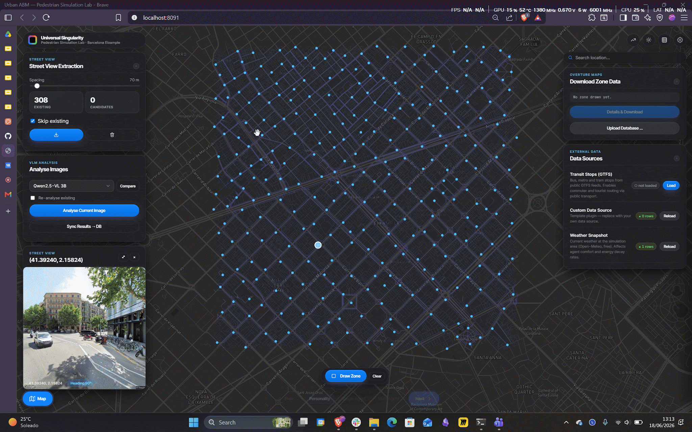
</p>

Street-level imagery captured at regular intervals across the pedestrian network. 308 existing viewpoints at 70m spacing provide visual context for agent perception — each point stores a panoramic street view that agents "see" when passing nearby.

### 3. Vision Analysis (VLM)

<p align="center">
  
  &nbsp;
  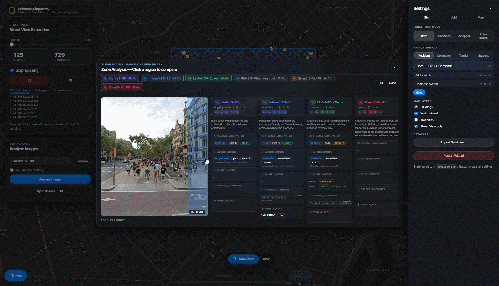
</p>

Multiple Vision Language Models were compared for structured scene analysis:

- **Forced JSON structuring** with Pydantic ensures consistent output schemas
- **Choice: Qwen3 VL 8B** — best balance of accuracy and speed for 7-feature spatial extraction
- 4 attempts to populate 7 features per viewpoint, with error handling for:
  - Echo of the system prompt (detected and reattempted)
  - Repetition (flagged and rerouted for unknown values)

<p align="center">
  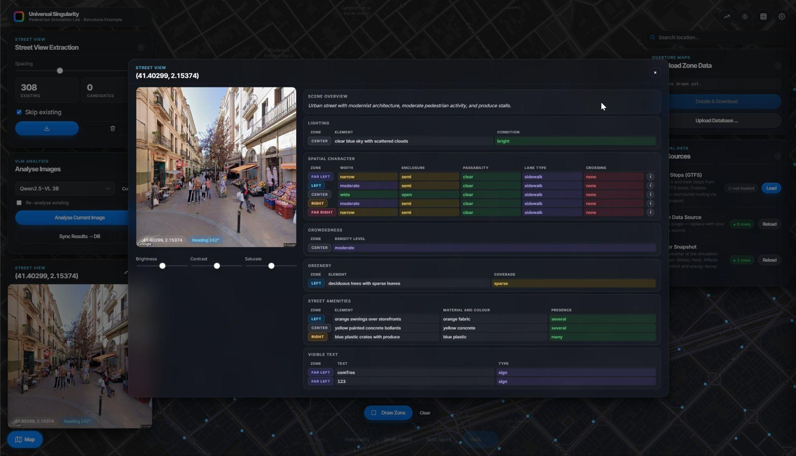
  &nbsp;
  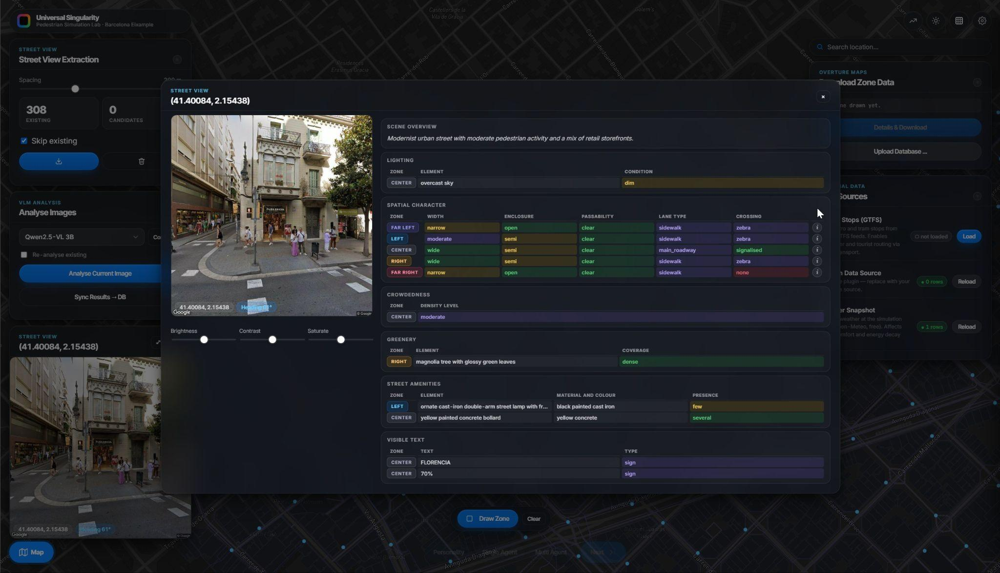
</p>

---

## The Agent

### Profile & Daily Plan

<p align="center">
  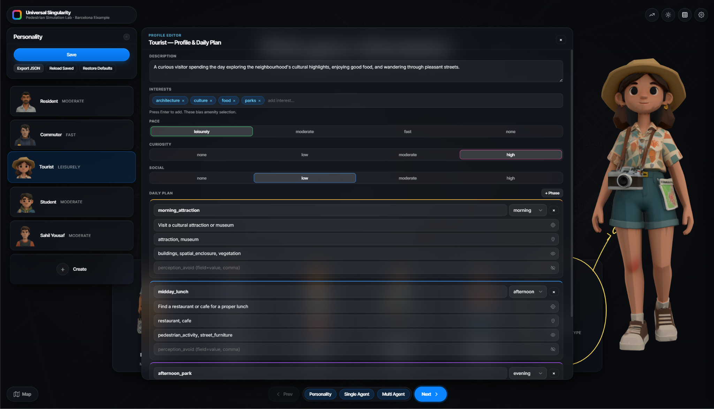
  &nbsp;
  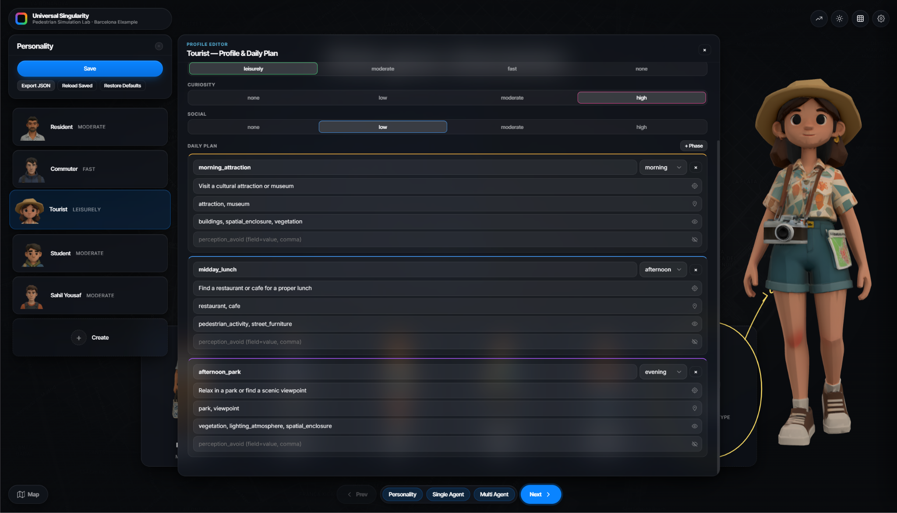
</p>

Each agent archetype has a **profile** (personality, preferences, age, background) and a **daily plan** structured into time blocks:

| Time Block | Example (Tourist) |
|---|---|
| `morning_attraction` | Visit a cultural attraction or museum |
| `midday_lunch` | Find a restaurant or cafe for a proper lunch |
| `afternoon_park` | Rest in a park or find a scenic viewpoint |

The daily plan drives goal selection — each block specifies target amenity types and spatial preferences that the LLM uses to evaluate candidate destinations.

### Mobility

<p align="center">
  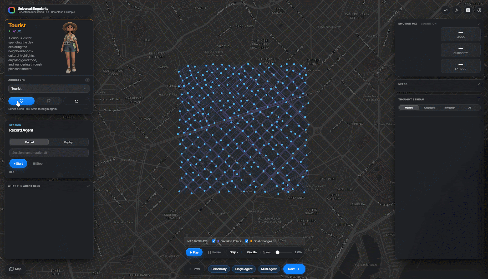
</p>

The mobility system uses a **hybrid approach**:

<p align="center">
  
</p>

| Component | Role |
|---|---|
| **LLM Driver** | Makes contextual movement decisions based on perception, needs, and goals |
| **Rule-Based** | Triggered when the agent is closer to or far from target — keeps agent on track |
| **Live Update** | Agent path recalculated as new information is perceived |

Each agent runs four decision blocks per simulation step:

| Block | Purpose | Frequency |
|---|---|---|
| **Needs** | Decay hunger/energy/social/comfort; LLM evaluates satisfaction at amenities | Every step |
| **Cognition** | LLM updates mood, curiosity, fatigue from recent experience | Every 10 steps |
| **Plan** | Resolve destinations, compute shortest paths, filter candidate edges | Every step |
| **Mobility** | LLM chooses next street edge (or rule-based fallback when budget exhausted) | Every step |

### Emotions

<p align="center">
  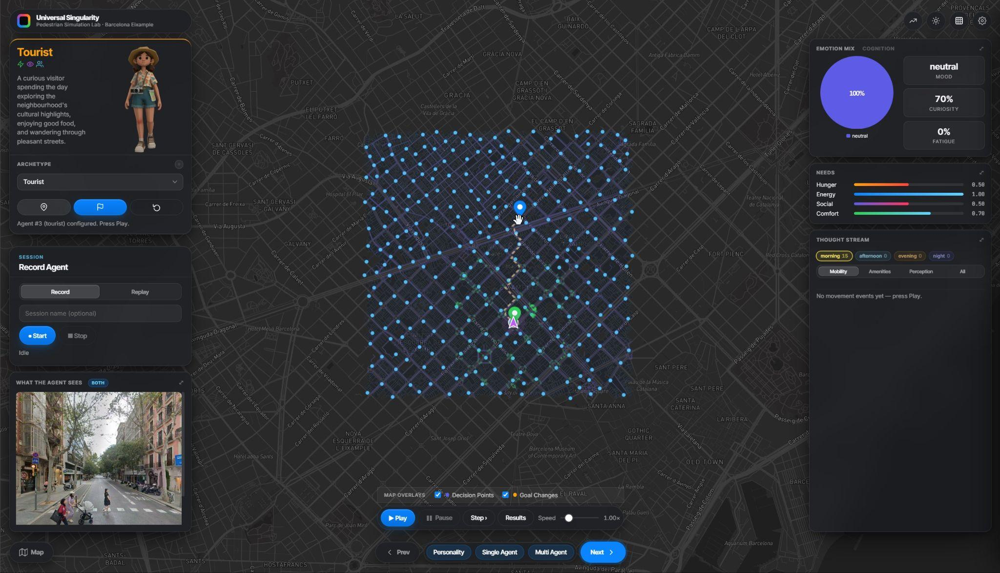
</p>

The emotion system operates on two timescales:

**Needs Module** — updated per step (96 steps/day, 15 min/step):

| Need | Decay Rate | Source |
|---|---|---|
| Hunger | +0.035/step | American Time Use Survey 2024 |
| Energy | calibrated | Drapeau et al., 2019 |
| Social | calibrated | American Time Use Survey 2024 |
| Comfort | calibrated | Environmental perception |

**Emotion Module** — updated every 10 steps:

| Emotion | Quadrant (Valence × Arousal) |
|---|---|
| Excited | High valence, High arousal |
| Stressed | Low valence, High arousal |
| Relaxed | High valence, Low arousal |
| Bored | Low valence, Low arousal |

**Thought Stream & Perception:**

<p align="center">
  
</p>

Agents perceive nearby amenities within a 50m radius. The nearest JSON point provides spatial context — amenity types, descriptions, and vision analysis data — that feeds into the thought stream. The thought stream records mobility decisions, amenity interactions, and perception events categorized by time of day (morning, afternoon, evening, night).

### LLM Selection

<p align="center">
  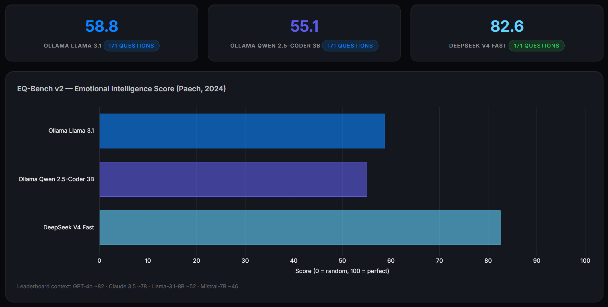
</p>

LLM selection was guided by the **EQ-Bench V2 Emotional Intelligence Score** (Paech, 2024):

| Model | EQ Score | Notes |
|---|---|---|
| Ollama Llama 3.1 | 58.8 | Local, free |
| Ollama Qwen 2.5-Coder 3B | 55.1 | Lightweight |
| DeepSeek V4 Fast | **82.6** | Best emotional reasoning |

Leaderboard context: GPT-4o ~82 · Claude 3.5 ~78 · Llama-3.1-8B ~52 · Mistral-7B ~46

---

## Prompt Architecture

The core innovation of CityMind is that agents don't follow scripted behavior — they **think through prompts** structured to mirror human cognitive processes. Each decision block sends a carefully constructed prompt to the LLM, grounding its reasoning in the agent's identity, current state, and sensory context.

### How Agents Think

Each simulation step, four blocks fire in sequence. The prompts are designed so the LLM reasons the way a real pedestrian would — weighing competing needs, reacting to what they see, and making imperfect but human-like tradeoffs:

```
┌─────────────────────────────────────────────────────┐
│  STEP N                                             │
│                                                     │
│  1. NeedsBlock     → Decay hunger/energy/social/    │
│                      comfort. LLM evaluates visual  │
│                      environment + amenity visits    │
│                                                     │
│  2. PlanBlock      → Advance daily plan phases,     │
│                      resolve target amenities,       │
│                      trigger en-route stops          │
│                                                     │
│  3. CognitionBlock → Every 10 steps: LLM writes     │
│     (periodic)       first-person inner monologue,   │
│                      updates mood/curiosity/fatigue  │
│                                                     │
│  4. MobilityBlock  → LLM chooses next street edge   │
│                      from candidates, balancing      │
│                      exploration vs. destination     │
└─────────────────────────────────────────────────────┘
```

### Cognition Prompt — Inner Life

The cognition prompt is designed to produce **vivid, human-like inner monologues** rather than sterile status reports. The system prompt explicitly instructs:

> *"You are writing the inner life of a pedestrian agent navigating Barcelona's Eixample district."*

Key design choices that make the output feel human:

- **Anti-cliché rules**: The prompt forbids filler phrases like "as the day progresses", "I find myself", or opening with time of day
- **Event-grounded**: The LLM must reference *specific* events from recent history — actual streets walked, amenities visited, encounters had
- **Needs → Mood mapping**: Explicit rules mirror psychological research:
  - `hunger > 0.7` → stressed, irritable ("hangry effect")
  - `energy < 0.3` → bored, low engagement, fatigue dominates
  - `social > 0.7` (unmet) → bored, disengaged, low-arousal loneliness
  - `comfort < 0.3` → stressed, physical discomfort dominates attention
- **Circumplex model**: Moods are constrained to the five states from Russell's (1980) model: `excited`, `stressed`, `bored`, `relaxed`, `neutral` — mapped to valence × arousal quadrants
- **Archetype-specific memory**: Tourists get fleeting impressions (1 summary, refreshed every 30 steps), residents accumulate rich long-term memory (5 summaries consolidated every 60 steps)

Example output:
```json
{
  "mood": "excited",
  "curiosity": 0.85,
  "fatigue": 0.12,
  "summary": "The carved stone facade on Carrer de Mallorca stopped me mid-stride — 
   I almost missed it behind the plane trees. Hunger is creeping in but I want to 
   see what's around the next corner before I look for lunch."
}
```

### Mobility Prompt — Street-Level Decisions

The mobility prompt gives the LLM a rich sensory context that mirrors what a real pedestrian perceives at an intersection:

```
Agent Profile:
  Archetype: tourist
  Time of day: morning
  Needs: hunger=0.42, energy=0.78, social=0.55, comfort=0.68
  Mood: excited, Curiosity: 0.85, Fatigue: 0.12
  Current Position: lon=2.163821, lat=41.391205

Scene description at current location (from visual analysis):
  Scene: Wide tree-lined boulevard with ornate Modernista facades
  Spatial character: Grand symmetrical avenue, ~30m wide
  Greenery: Mature plane trees forming canopy, planted median
  Crowdedness: Moderate pedestrian flow, some cyclists

Target Destination: Casa Batllo (type: attraction) — approximately 280m to the NE

Candidate Edges/Destinations:
  [0] edge_id=4521 dir=fwd amenities=[cafe, pharmacy] env=[Narrow side street...] [NEW]
  [1] edge_id=4522 dir=fwd amenities=[restaurant] env=[Busy commercial...] [visited 2x]
  [2] edge_id=4523 dir=fwd amenities=[] env=[Quiet residential...] [NEW]

** FREE EXPLORATION STEP (280m to destination) — 2 free step(s) left.
   Follow your curiosity, satisfy a need, or enjoy an interesting environment.
   Keep broadly heading toward NE. **
```

Key design features:

- **Visited-edge penalties**: `[visited 2x — strongly avoid revisiting]` discourages looping, while `[NEW]` tags encourage exploration — mimicking a real pedestrian's preference for novelty
- **Archetype-specific perception guidance**: Tourists prefer "interesting architecture, street art, outdoor cafes"; residents prefer "quiet, well-maintained residential streets with greenery"
- **Distance-aware urgency**: The prompt escalates from "FREE EXPLORATION" → "GETTING CLOSE" → "ALMOST THERE" as the agent approaches its destination, mirroring how a real person shifts from wandering to purposeful navigation
- **GPS vs. Direction Sense**: Different archetypes navigate differently — commuters follow GPS (`[SHORTEST PATH TO DESTINATION]` label is mandatory), tourists use compass direction sense ("head NE"), residents use both

### Needs Prompt — Environmental Response

The needs system uses **two LLM evaluation paths** that mirror how humans respond to their environment:

**1. Visual Satisfaction** (every 5 steps) — How does being in this physical space affect the agent?

The prompt explicitly calibrates comfort on a small, realistic scale:
> *"Excellent space (greenery, good lighting, lively pedestrian activity) → +0.06 to +0.08 max; average urban street → 0.00 to +0.02; poor quality (run-down, dark, desolate) → −0.05 to −0.08. Most streets should score near zero."*

**2. Amenity Satisfaction** (when within 30m of an amenity) — How does visiting this place meet needs?

The prompt considers the agent's current mental state: a stressed tourist gets less social satisfaction from a cafe than a relaxed one. A curious student gains more energy from discovering a new library.

Rule-based fallback ensures the system degrades gracefully when LLM is unavailable:

| Amenity Type | Hunger | Energy | Social | Comfort |
|---|---|---|---|---|
| Restaurant | −0.40 | +0.10 | +0.10 | +0.05 |
| Cafe | −0.20 | +0.15 | +0.20 | +0.08 |
| Park | — | +0.25 | +0.15 | +0.10 |
| Gym | — | −0.10 | +0.10 | +0.04 |

---

## Human Calibration

Every parameter in the system is calibrated against real-world data to produce behavior that approximates actual human patterns.

### Needs Decay Rates

Each simulation step represents 15 minutes of real time (96 steps = 1 day). Decay rates are derived from empirical sources:

| Need | Decay/Step | Calibration Source | Real-World Basis |
|---|---|---|---|
| **Hunger** | +0.035 | American Time Use Survey 2024 | 3 meals/day, ~5h between meals → 20 steps to reach 0.7 threshold |
| **Energy** | −0.015 | Drapeau et al., 2019 | 16 waking hours of walking (2232 kcal/day) → 64 steps to deplete |
| **Social** | +0.025 | American Time Use Survey 2024 | 35 min social/day, ~6h alone → 24 steps to reach 0.7 threshold |
| **Comfort** | −0.008 | Urban walking affect study, 2025 | Environment-responsive over ~2 hours of walking |

### Cross-Need Coupling

Needs don't decay independently — they interact the way real human physiology does:

| Coupling | Mechanism | Multiplier |
|---|---|---|
| Hunger → Energy | Starving agents lose energy faster (less fuel for walking) | Up to ×1.3 when hunger > 0.5 |
| Comfort → Energy | Discomfort is tiring | Up to ×1.2 when comfort < 0.5 |
| Energy → Hunger | Exhaustion amplifies hunger signals | Up to ×1.2 when energy < 0.3 |
| Energy → Social | Too tired to engage with crowds | Social bonus scales to 0 when energy < 0.3 |

Weather also modulates decay: rain increases comfort loss (×1.5), heat accelerates energy drain (×1.3), wind compounds discomfort (×1.2).

### Exploration Budgets

The exploration budget system controls how much an agent deviates from the shortest path — calibrated to match how different real-world pedestrian types actually navigate:

| Archetype | Free Steps | Cycle Pattern | Real-World Analogy |
|---|---|---|---|
| **Commuter** | 0 | Always Dijkstra | GPS navigation, time-optimizing |
| **Resident** | 1 | F → D → F → D | Familiar with shortcuts, occasional detour |
| **Student** | 2 | FF → D → FF → D | Social, budget-conscious, open to discovery |
| **Tourist** | 3 | FFF → D → FFF → D | Exploratory, destination is secondary to experience |

Where F = free LLM choice, D = forced Dijkstra step toward destination. This guarantees that even the most exploratory tourist makes periodic net progress toward their goal.

**Distance-based budget reduction**: As agents approach their destination, the budget automatically shrinks:
- Beyond `getting_close_m` → full budget (free exploration)
- Within `getting_close_m` → lean strongly toward destination
- Within `almost_there_m` → pure Dijkstra (no more detours)

These thresholds are archetype-specific: tourists get a wider convergence window (60m/150m) because they have more free steps to recover from, while residents converge tighter (40m/100m).

### Archetype Memory Policies

Different pedestrian types form and retain memories differently, matching real cognitive patterns:

| Archetype | Summary Interval | Max Summaries | Memory Focus | Consolidation |
|---|---|---|---|---|
| **Tourist** | Every 30 steps | 1 (replaced) | Places seen, sights, fleeting impressions | None — fresh each cycle |
| **Commuter** | Every 45 steps | 2 (FIFO) | Routes taken, efficiency patterns, time habits | Pruned oldest |
| **Student** | Every 45 steps | 3 (FIFO) | Social interactions, study spots, local discoveries | Pruned oldest |
| **Resident** | Every 60 steps | 5 (consolidated) | Neighbourhood familiarity, routines, known places | LLM merges into unified long-term memory |

Residents are the only archetype with **long-term memory consolidation** — their episodic summaries are periodically merged by the LLM into a single unified narrative (up to 2000 characters) that persists indefinitely, modeling how residents build deep familiarity with their neighbourhood over time.

---

## The City

### Data Storage

<p align="center">
  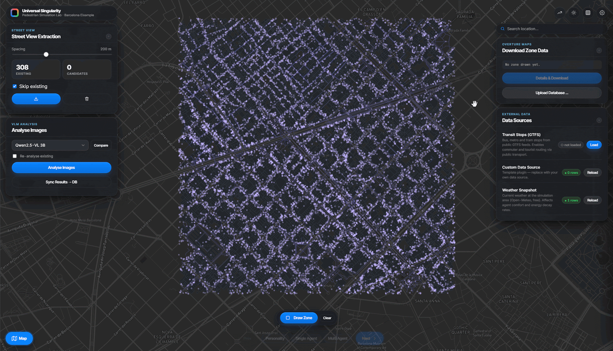
</p>

**Choice: DuckDB** — single-file database with easy scalability and native spatial extension support. Stores buildings, roads, amenities, pedestrian network, and VLM analysis results.

<p align="center">
  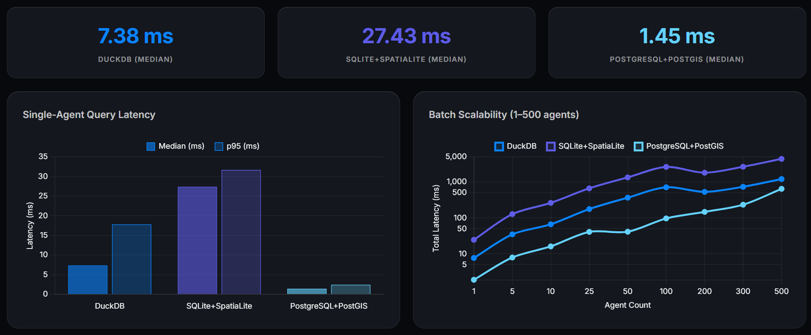
</p>

### LLM Engine

<p align="center">
  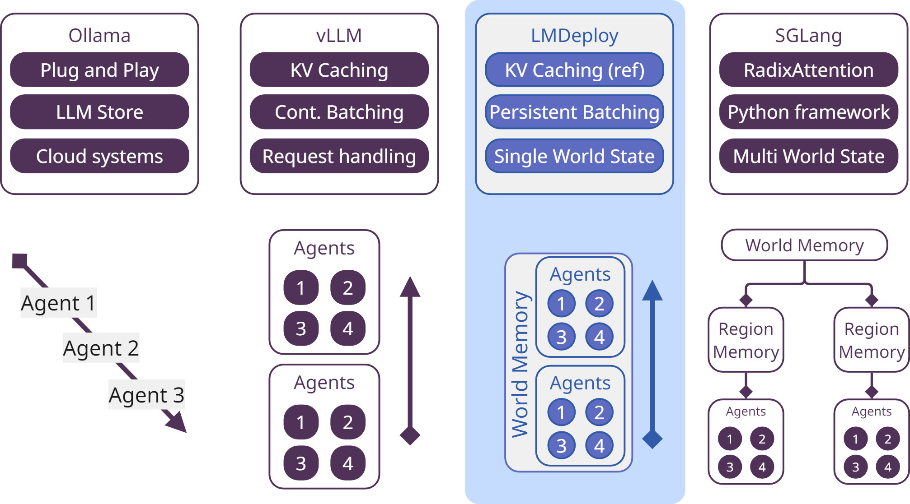
</p>

The engine supports two modes:

**LocalLLMAgents:**
- Multi-agent with multiple archetypes
- Multi-agent single archetype
- High-scale multi-agent across multiple GPUs
- Synchronous execution for single agent

**APILLMAgents:**
- Dynamic API key switching for async queries
- Synchronous fallback for single agent
- Hot-swap between providers at runtime

---

## Observations

### Tourist Simulation — 25 Agents, 4,751 Steps

<p align="center">
  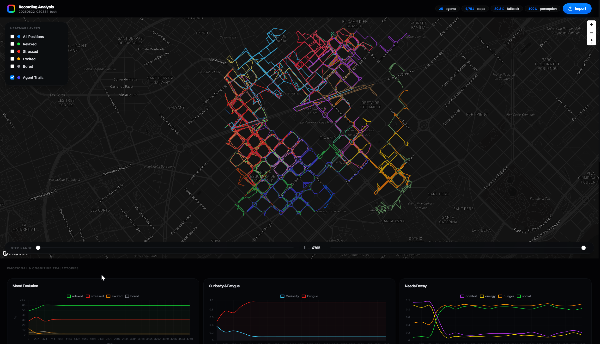
</p>

#### Amenities Only vs Vision + Amenities

<p align="center">
  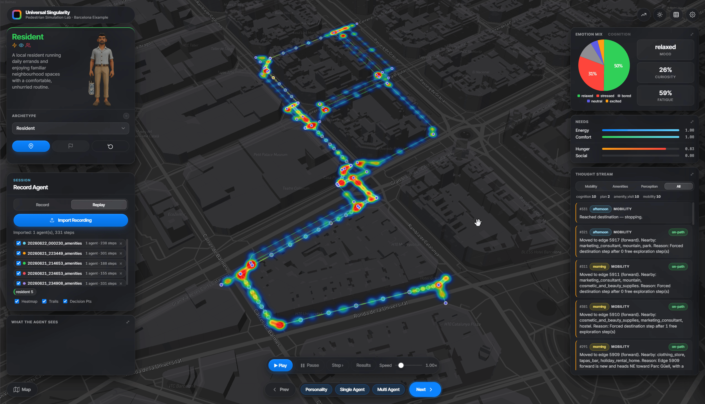
  &nbsp;
  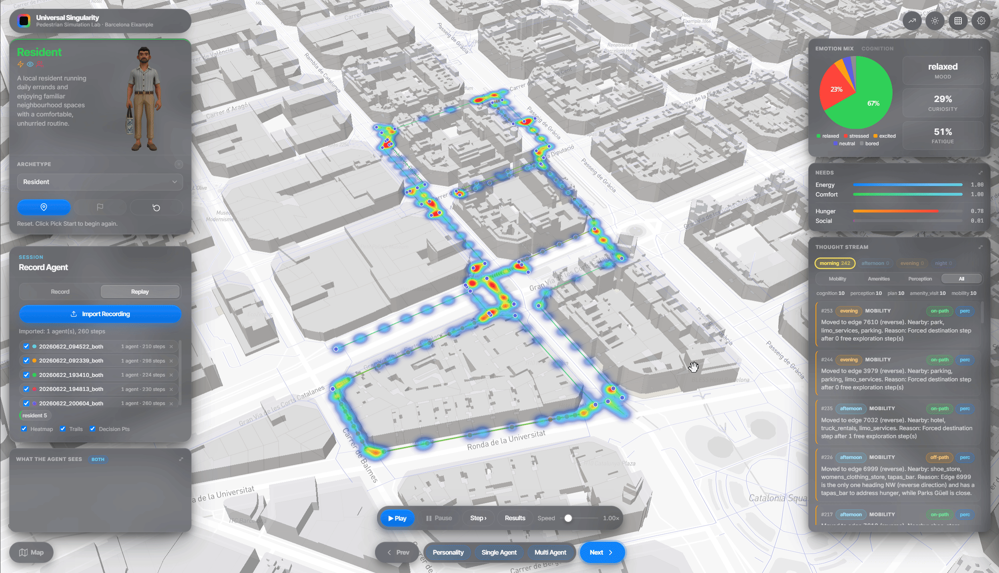
</p>

#### Coverage Density

<p align="center">
  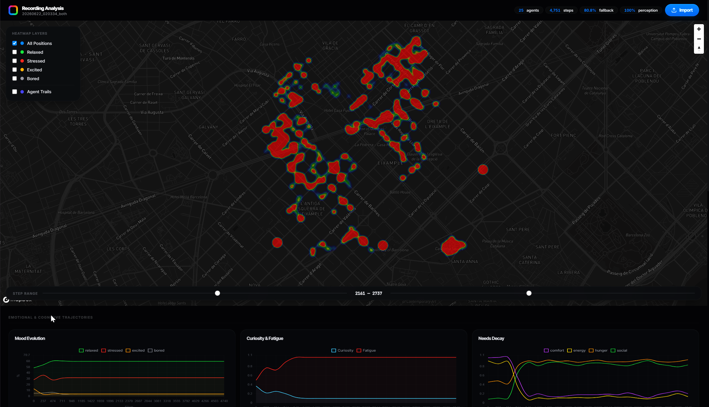
</p>

Key landmarks attracting tourist agent density: **Placa Catalunya**, **Casa de Punxes**, **Muñoz Ramonet Gardens**, **Casa Batllo**.

#### Emotion Heatmaps

<p align="center">
  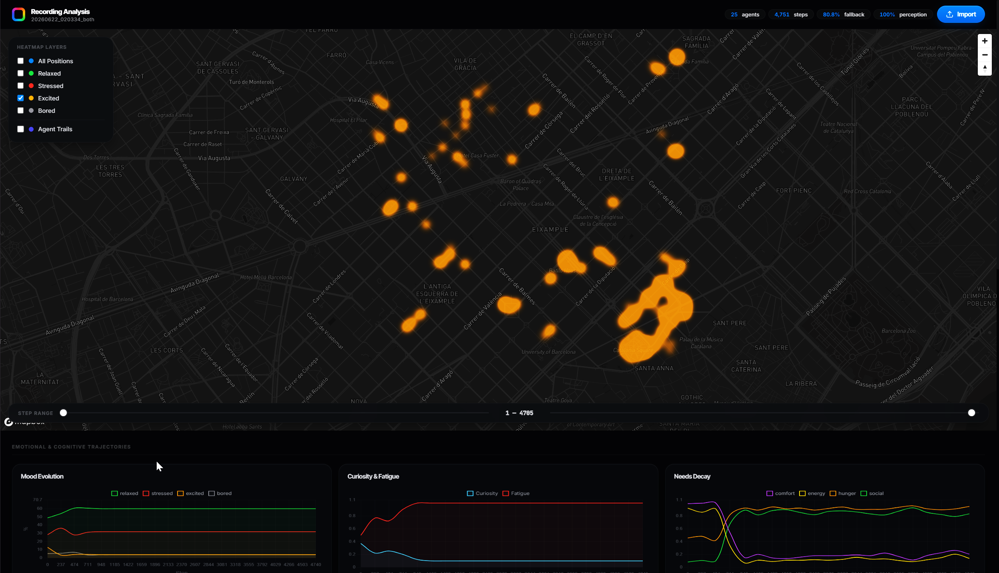
  &nbsp;
  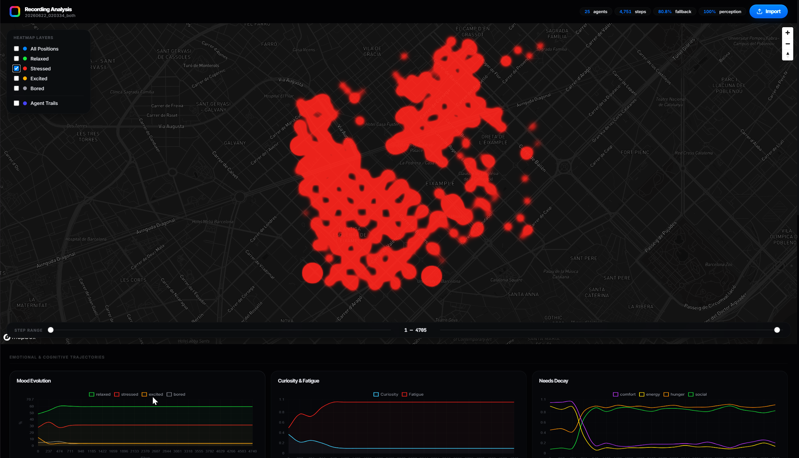
</p>
<p align="center">
  <em>Left: Excitement — concentrated around landmarks &nbsp;&nbsp;|&nbsp;&nbsp; Right: Stress — repetitive environment zones</em>
</p>

<p align="center">
  
  &nbsp;
  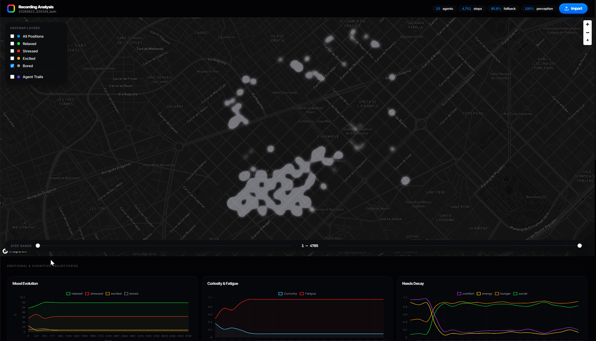
</p>
<p align="center">
  <em>Boredom — repetitive environments trigger disengagement</em>
</p>

---

## Architecture

```
Frontend (Mapbox GL + Three.js + Preact)
         | HTTP/REST
         v
FastAPI Backend (map_server.py, port 8000)
         |
   +-----+------------------+------------------+
   |                        |                   |
Mesa ABM Model         LLM Client          DuckDB Spatial
(CityModel +           (Ollama/OpenAI/     (buildings, roads,
 500 agents)            DeepSeek/vLLM)      amenities, network)
   |                        |
   +----+-------------------+
        |
  +-----+------+-------+-------+
  |            |       |       |
Needs     Cognition  Plan  Mobility
Block       Block    Block   Block
```

---

## Quick Start

### Prerequisites

- Python 3.11+
- Node.js 18+ (for frontend development)
- A Mapbox token ([get one free](https://account.mapbox.com/))
- An LLM provider: [Ollama](https://ollama.com/) (local, free) or a cloud API key

### 1. Install

```bash
git clone https://github.com/your-username/LLM_Based_UrbanABM.git
cd LLM_Based_UrbanABM
pip install -r requirements.txt
cp .env.example .env   # then edit .env with your tokens
```

### 2. Configure `.env`

```env
# LLM — pick one provider
LLM_PROVIDER=ollama          # ollama | openai | deepseek | gemini | vllm | lmdeploy
LLM_MODEL=llama3.1           # model name for your provider
LLM_API_KEY=                 # not needed for Ollama
LLM_CALLS_PER_STEP=20        # budget guard (0 = fully rule-based, no LLM)

# Agents
NUM_AGENTS=15                # 1-100 recommended
PERCEPTION_MODE=both         # amenities | perception | both | rule_based

# Tokens
MAPBOX_TOKEN=pk.your_token_here
```

### 3. Run

**One-click (Windows):**
```
double-click start_system.bat
```

**Manual (all platforms):**
```bash
# Terminal 1 — Backend API server
cd Backend/Agent && python map_server.py

# Terminal 2 — Frontend static server
cd Frontend && python -m http.server 8091

# Open http://localhost:8091
```

**Using Ollama locally?**
```bash
ollama serve              # in a separate terminal
ollama pull llama3.1      # download the model
```

**Fully rule-based (no LLM, ~10ms/step):**
```env
LLM_CALLS_PER_STEP=0
```

---

## UI Tour

### Character Selection

<p align="center">
  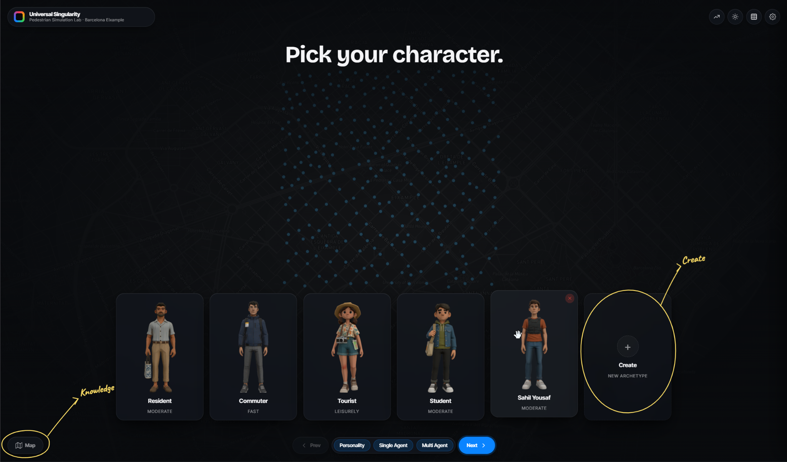
</p>

Choose from five agent archetypes — Resident, Commuter, Tourist, Student — or create your own custom archetype. Each character has a 3D model preview and distinct personality traits.

### Personality Editor

<p align="center">
  
</p>

Edit agent archetypes — name, age, preferences, and daily activity schedules. Each archetype defines how the LLM reasons about movement decisions. A 3D character preview shows the agent model.

### Single Agent Lab

<p align="center">
  
</p>

Place a single agent with start/target locations and watch it navigate step-by-step. Inspect its emotion mix (pie chart), cognition state (mood, curiosity, fatigue), needs bars (hunger, energy, social, comfort), and what it "sees" through Street View perception. Record sessions for replay.

### Map & Data Panel

<p align="center">
  
</p>

Mapbox GL map with toggleable layers: building footprints, pedestrian walk network, amenity points, Street View analysis grid, and real-time agent positions. Includes Overture Maps zone download, Street View extraction controls, VLM analysis triggers, and external data source management (GTFS transit, custom data, weather).

### Recording & Analysis

<p align="center">
  
</p>

Post-simulation analysis dashboard showing all agent trajectories color-coded by emotional state, with timeline scrubbing and analytics panels for mood evolution, curiosity/fatigue tracking, and needs decay over the full simulation run.

---

## API Reference

The backend exposes a REST API on port 8000. Key endpoints:

| Method | Endpoint | Description |
|--------|----------|-------------|
| POST | `/api/step` | Advance simulation one step |
| POST | `/api/step_continuous` | Advance N steps continuously |
| GET | `/api/agents` | All agents as GeoJSON |
| GET | `/api/agent/{id}/memory` | Full KV + stream memory snapshot |
| GET | `/api/agent/{id}/stream` | Recent event log (mobility, cognition, needs) |
| GET | `/api/agent/{id}/cognition` | Current mood, curiosity, fatigue, needs |
| GET | `/api/buildings` | Building footprints as GeoJSON |
| GET | `/api/walk_network` | Pedestrian network edges as GeoJSON |
| GET | `/api/amenities` | Points of interest as GeoJSON |
| GET | `/api/llm/stats` | Token usage and latency stats |
| POST | `/api/config/llm` | Hot-swap LLM provider at runtime |

Full API documentation: [`Backend/Agent/BACKEND_README.md`](Backend/Agent/BACKEND_README.md)

---

## Project Structure

```
LLM_Based_UrbanABM/
├── Backend/
│   ├── Agent/                  # FastAPI server + Mesa model
│   │   ├── map_server.py       # Entry point (port 8000)
│   │   ├── model/              # CityModel + CityAgent
│   │   └── routers/            # API endpoints (9 routers)
│   ├── LLM/                    # LLM client, config, prompts
│   │   ├── Thinking/blocks/    # Decision blocks (needs, cognition, plan, mobility)
│   │   └── Memory/             # KVMemory + StreamMemory
│   └── Environment/            # DuckDB spatial databases + data pipelines
├── Frontend/
│   ├── src/                    # TypeScript + Preact components
│   │   ├── components/         # Panel3, Panel4, Panel5, modals, map
│   │   ├── api/client.ts       # API client (main + lab server)
│   │   └── main_legacy.ts      # Core map + simulation logic
│   └── dist/                   # Production build
├── benchmark/                  # 5 Jupyter notebooks + result PNGs
├── test/                       # Research lab (agent_lab_server.py)
├── scripts/                    # Street View download + VLM analysis
└── Documentation/              # Tracking data + research notes
```

---

## Tech Stack

| Layer | Technology |
|-------|-----------|
| **Frontend** | Mapbox GL JS, Three.js, Preact, TypeScript, Vite |
| **Backend** | FastAPI, Mesa (ABM framework), asyncio |
| **Database** | DuckDB + Spatial extension |
| **LLM** | OpenAI-compatible API (Ollama, vLLM, DeepSeek, Gemini, LMDeploy) |
| **VLM** | Qwen3 VL 8B (street scene perception) |
| **Spatial Data** | Overture Maps (BigQuery), OpenStreetMap (OSMnx) |
| **Recording** | GeoParquet (Apache Arrow) |

---

## Benchmarks

Five Jupyter notebooks in `benchmark/` evaluate each technology choice:

| # | Notebook | Question |
|---|----------|----------|
| 01 | Database Comparison | DuckDB vs SQLite+SpatiaLite vs PostgreSQL+PostGIS |
| 02 | LLM Provider Comparison | Ollama vs vLLM vs GPT-4o — latency and decision quality |
| 03 | Map Data Comparison | Overture Maps vs OpenStreetMap — coverage and schema quality |
| 04 | VLM Perception Comparison | Qwen2.5-VL-3B vs 7B — street scene analysis accuracy |
| 05 | System Integration | LLM-driven vs rule-based agents — humanistic behavior scoring |

---

## Limitations

| # | Limitation | Detail |
|---|---|---|
| 01 | **Hallucination Risk** | The more data inserted into the system, the more the LLM hallucinates metrics |
| 02 | **Sub-Category of Emotions** | The emotions module currently limits the agent's deeper insight or feelings |
| 03 | **Fine-grain Recovery Metrics** | Recovery and decay of emotions are generalised — needs to be specific to the amenity and information received |
| 04 | **Data Reproducibility** | LLM-based decisions are inherently non-deterministic |

---

## Future Applications

| # | Application | Description |
|---|---|---|
| 01 | **Inclusive City Design & Analysis** | Analyse the city's capability to satisfy varied populations to simulate and understand discrepancies in infrastructure design relating to emotional wellbeing |
| 02 | **Personalised Navigation System** | Create a persona of yourself, with your emotional and mental database, to propose navigation options from point A to point B |
| 03 | **Citizen Journey Simulation** | Simulate a citizen journey through the city to understand issues related to public image and economic impact or development opportunities |

---

## Citation

```bibtex
@mastersthesis{yousaf2026citymind,
  title   = {CityMind: LLM-Powered Urban Agents — A Comprehensive Modelling of Human Behaviour in an Urban Environment},
  author  = {Yousaf, Sahil},
  school  = {Institute for Advanced Architecture of Catalonia (IAAC)},
  year    = {2026},
  address = {Barcelona, Spain},
  note    = {MaAI02, supervised by Shajay Bhooshan}
}
```

---

## References

### Agent Simulation & State of the Art

- **Park, J., O'Brien, J., Cai, C., Morris, M., Liang, P., & Bernstein, M. (2023).** Generative Agents: Interactive Simulacra of Human Behavior. *Proceedings of the 36th Annual ACM Symposium on User Interface Software and Technology.*

- **Bougie, N. & Watanabe, K. (2025).** CitySim: Modeling Urban Behaviors with LLM-Driven Agent Simulation. *arXiv:2506.21805.*

- **Sentipolis (2025).** Emotion-Aware Agents for Social Simulations. *arXiv:2601.18027.*

- **Patterns of Life Simulation.** George Mason University. [GitHub](https://github.com/gmuggs/pol)

### Emotion Model (Circumplex Model of Affect)

- **Russell, J.A. (1980).** A circumplex model of affect. *Journal of Personality and Social Psychology*, 39(6), 1161–1178.

- **Emotional experiences of urban walking environments (2025).** *Journal of Transport & Health.* Applied the circumplex model to pedestrian environments (N=311). Found: mixed-use streets elicit excitement, greenery elicits relaxation, monotonous streets elicit boredom, underpasses/traffic elicit stress.

### Needs Decay Calibration

- **American Time Use Survey 2024.** U.S. Bureau of Labor Statistics. Used to derive hunger and social decay rates.

- **Drapeau, V. et al. (2019).** Effects of Different Physical Activity Levels on Energy Intake. *Nutrients.* Used to calibrate energy depletion rate over 16 waking hours.

### LLM Evaluation

- **Paech, S. (2024).** EQ-Bench v2: Emotional Intelligence Score. Used to select LLM providers for emotion-aware agent cognition.

### Urban Context

- IAAC Blog: [Urban Grid Transition — Mobility Strategies for Tourists and Locals Coexistence](https://blog.iaac.net/urban-grid-transition-mobility-strategies-for-tourists-and-locals-coexistence/)

---

## License

MIT License. See [LICENSE](LICENSE) for details.
