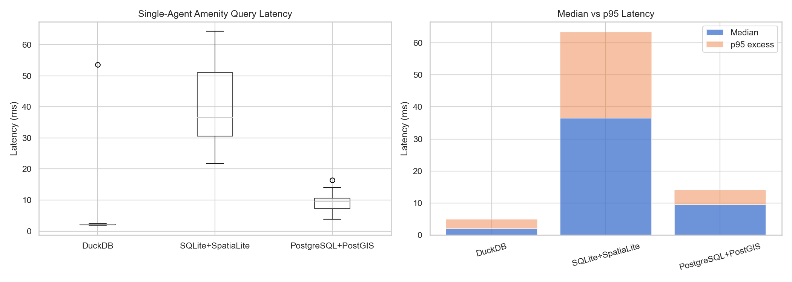
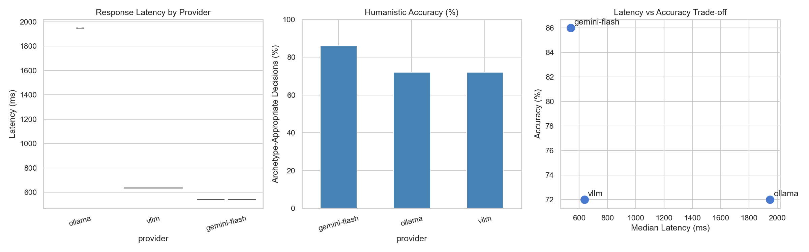
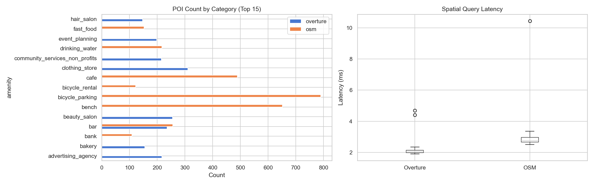
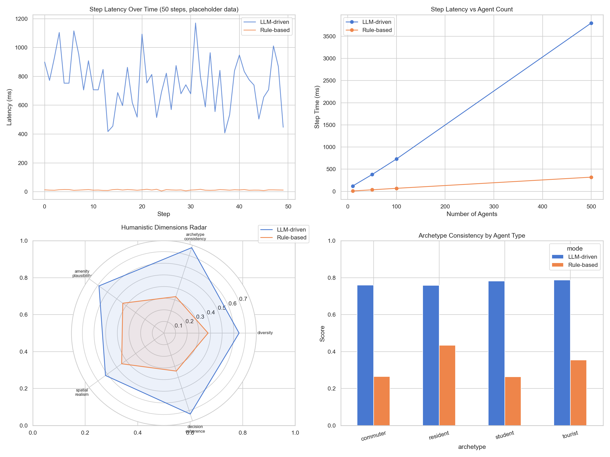

# LLM-Based UrbanABM

**Pedestrian simulation driven by large language models — Barcelona Eixample**


<p align="center">
  
</p>

## What is this?

An agent-based pedestrian simulation where each agent **reasons** about its movement decisions using a large language model instead of following predefined rules. Agents perceive their surroundings through street-level imagery, maintain memory of visited places, and adapt their behavior based on individual needs and personality.

Set in Barcelona's Eixample district, the system models four pedestrian archetypes — residents, commuters, tourists, and students — each with distinct movement patterns, goals, and decision-making styles shaped by LLM-generated cognition.

<p align="center">
  
  &nbsp;
  
</p>

---

## Architecture

```
Frontend (Mapbox GL + Three.js + Preact)
         | HTTP/REST
         v
FastAPI Backend (map_server.py, port 8000)
         |
   +-----+------------------+------------------+
   |                        |                   |
Mesa ABM Model         LLM Client          DuckDB Spatial
(CityModel +           (Ollama/OpenAI/     (buildings, roads,
 500 agents)            DeepSeek/vLLM)      amenities, network)
   |                        |
   +----+-------------------+
        |
  +-----+------+-------+-------+
  |            |       |       |
Needs     Cognition  Plan  Mobility
Block       Block    Block   Block
```

Each agent runs four decision blocks per simulation step:

| Block | Purpose | Frequency |
|-------|---------|-----------|
| **Needs** | Decay hunger/energy/social/comfort; LLM evaluates satisfaction at amenities | Every step |
| **Cognition** | LLM updates mood, curiosity, fatigue from recent experience | Every 10 steps |
| **Plan** | Resolve destinations, compute shortest paths, filter candidate edges | Every step |
| **Mobility** | LLM chooses next street edge (or rule-based fallback when budget exhausted) | Every step |

---

## Key Features

- **LLM-powered reasoning** — Agents make contextual movement decisions, not rule-based particle physics
- **4 archetypes** — Resident (familiar routes), Commuter (efficient paths), Tourist (exploratory), Student (social, budget-conscious)
- **Dual memory system** — Key-value state (position, needs, cognition) + append-only event stream (mobility, amenity visits, mood changes)
- **Budget guard** — `LLM_CALLS_PER_STEP` caps LLM usage per tick; remaining agents use a least-visited-edge heuristic
- **Multi-provider LLM** — Hot-swap between Ollama, OpenAI, DeepSeek, Gemini, vLLM, LMDeploy from the UI
- **Street View perception** — VLM scene analysis (Qwen2.5-VL) feeds visual context into agent prompts
- **GeoParquet recording** — Export full agent trajectories for analysis in QGIS or ML pipelines
- **Overture Maps integration** — Download buildings, amenities, and walk networks for any zone via BigQuery
- **5 benchmark notebooks** — Database, LLM provider, map data, VLM, and end-to-end humanistic scoring

---

## Quick Start

### Prerequisites

- Python 3.11+
- Node.js 18+ (for frontend development)
- A Mapbox token ([get one free](https://account.mapbox.com/))
- An LLM provider: [Ollama](https://ollama.com/) (local, free) or a cloud API key

### 1. Install

```bash
git clone https://github.com/your-username/LLM_Based_UrbanABM.git
cd LLM_Based_UrbanABM
pip install -r requirements.txt
cp .env.example .env   # then edit .env with your tokens
```

### 2. Configure `.env`

```env
# LLM — pick one provider
LLM_PROVIDER=ollama          # ollama | openai | deepseek | gemini | vllm | lmdeploy
LLM_MODEL=llama3.1           # model name for your provider
LLM_API_KEY=                 # not needed for Ollama
LLM_CALLS_PER_STEP=20        # budget guard (0 = fully rule-based, no LLM)

# Agents
NUM_AGENTS=15                # 1-100 recommended
PERCEPTION_MODE=both         # amenities | perception | both | rule_based

# Tokens
MAPBOX_TOKEN=pk.your_token_here
```

### 3. Run

**One-click (Windows):**
```
double-click start_system.bat
```

**Manual (all platforms):**
```bash
# Terminal 1 — Backend API server
cd Backend/Agent && python map_server.py

# Terminal 2 — Frontend static server
cd Frontend && python -m http.server 8091

# Open http://localhost:8091
```

**Using Ollama locally?**
```bash
ollama serve              # in a separate terminal
ollama pull llama3.1      # download the model
```

**Fully rule-based (no LLM, ~10ms/step):**
```env
LLM_CALLS_PER_STEP=0
```

---

## UI Tour

### Personality Editor (Panel 3)

<p align="center">
  
</p>

Edit agent archetypes — name, age, preferences, and daily activity schedules. Each archetype defines how the LLM reasons about movement decisions. A 3D character preview shows the agent model.

### Single Agent Lab (Panel 4)

<p align="center">
  
</p>

Place a single agent with start/target locations and watch it navigate step-by-step. Inspect its emotion mix (pie chart), cognition state (mood, curiosity, fatigue), and what it "sees" through Street View perception. Record sessions for replay.

### Multi-Agent Simulation (Panel 5)

<p align="center">
  
</p>

Spawn up to 100 agents with configurable archetype mix. Choose spawn modes — random, click-to-place, near POIs, or home/work pairs. Run continuous simulation and observe emergent pedestrian flows on the map.

### Settings & LLM Hot-Swap

<p align="center">
  
</p>

Switch LLM providers at runtime without restarting. Configure perception mode, navigation parameters, and map appearance from the settings drawer.

### Map Visualization

<p align="center">
  
</p>

Mapbox GL map with toggleable layers: building footprints, pedestrian walk network, amenity points, Street View analysis grid, and real-time agent positions color-coded by archetype.

---

## Benchmarks

Five Jupyter notebooks in `benchmark/` evaluate each technology choice:

| # | Notebook | Question |
|---|----------|----------|
| 01 | Database Comparison | DuckDB vs SQLite+SpatiaLite vs PostgreSQL+PostGIS |
| 02 | LLM Provider Comparison | Ollama vs vLLM vs GPT-4o — latency and decision quality |
| 03 | Map Data Comparison | Overture Maps vs OpenStreetMap — coverage and schema quality |
| 04 | VLM Perception Comparison | Qwen2.5-VL-3B vs 7B — street scene analysis accuracy |
| 05 | System Integration | LLM-driven vs rule-based agents — humanistic behavior scoring |

<p align="center">
  
  &nbsp;
  
</p>
<p align="center">
  
  &nbsp;
  
</p>

---

## API Reference

The backend exposes a REST API on port 8000. Key endpoints:

| Method | Endpoint | Description |
|--------|----------|-------------|
| POST | `/api/step` | Advance simulation one step |
| POST | `/api/step_continuous` | Advance N steps continuously |
| GET | `/api/agents` | All agents as GeoJSON |
| GET | `/api/agent/{id}/memory` | Full KV + stream memory snapshot |
| GET | `/api/agent/{id}/stream` | Recent event log (mobility, cognition, needs) |
| GET | `/api/agent/{id}/cognition` | Current mood, curiosity, fatigue, needs |
| GET | `/api/buildings` | Building footprints as GeoJSON |
| GET | `/api/walk_network` | Pedestrian network edges as GeoJSON |
| GET | `/api/amenities` | Points of interest as GeoJSON |
| GET | `/api/llm/stats` | Token usage and latency stats |
| POST | `/api/config/llm` | Hot-swap LLM provider at runtime |

Full API documentation: [`Backend/Agent/BACKEND_README.md`](Backend/Agent/BACKEND_README.md)

---

## Project Structure

```
LLM_Based_UrbanABM/
├── Backend/
│   ├── Agent/                  # FastAPI server + Mesa model
│   │   ├── map_server.py       # Entry point (port 8000)
│   │   ├── model/              # CityModel + CityAgent
│   │   └── routers/            # API endpoints (9 routers)
│   ├── LLM/                    # LLM client, config, prompts
│   │   ├── Thinking/blocks/    # Decision blocks (needs, cognition, plan, mobility)
│   │   └── Memory/             # KVMemory + StreamMemory
│   └── Environment/            # DuckDB spatial databases + data pipelines
├── Frontend/
│   ├── src/                    # TypeScript + Preact components
│   │   ├── components/         # Panel3, Panel4, Panel5, modals, map
│   │   ├── api/client.ts       # API client (main + lab server)
│   │   └── main_legacy.ts      # Core map + simulation logic
│   └── dist/                   # Production build
├── benchmark/                  # 5 Jupyter notebooks + result PNGs
├── test/                       # Research lab (agent_lab_server.py)
├── scripts/                    # Street View download + VLM analysis
└── Documentation/              # Tracking data + research notes
```

---

## Tech Stack

| Layer | Technology |
|-------|-----------|
| **Frontend** | Mapbox GL JS, Three.js, Preact, TypeScript, Vite |
| **Backend** | FastAPI, Mesa (ABM framework), asyncio |
| **Database** | DuckDB + Spatial extension |
| **LLM** | OpenAI-compatible API (Ollama, vLLM, DeepSeek, Gemini, LMDeploy) |
| **Spatial Data** | Overture Maps (BigQuery), OpenStreetMap (OSMnx) |
| **VLM** | Qwen2.5-VL (street scene perception) |
| **Recording** | GeoParquet (Apache Arrow) |

---

## Research Lab

An isolated test harness for single-agent research runs on port 8100:

```bash
cd test && python agent_lab_server.py
```

Features a 4-tab interface for inspecting agent movement, spatial experience (perception diary), cognitive state (path adherence, thought stream), and narrative generation (generic vs memory-aware LLM narratives).

See [`test/README.md`](test/README.md) for full documentation.

---

## Citation

If you use this work in academic research:

```bibtex
@mastersthesis{urbanabm2026,
  title   = {LLM-Based Urban Agent-Based Modelling: Pedestrian Simulation with Large Language Model Cognition},
  author  = {TODO},
  school  = {Institute for Advanced Architecture of Catalonia (IAAC)},
  year    = {2026},
  address = {Barcelona, Spain}
}
```

---

## License

MIT License. See [LICENSE](LICENSE) for details.
